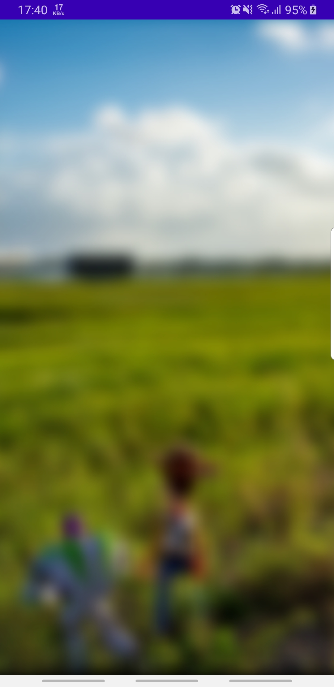
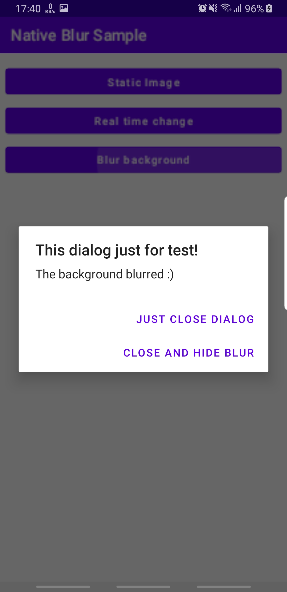
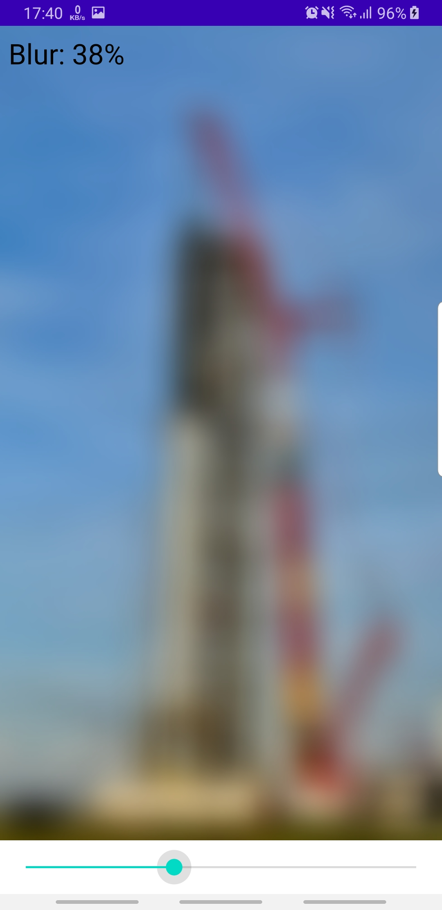

[](https://jitpack.io/#aabolfazl/Native-Blur)

# Native-Blur

The Native-Blur is a C++/Kotlin libraray for blur bitmaps and activity, mobile-ready, android
compatible, powered by Java Native Interface(JNI) library for Android.

## Demo application .apk file
[Download .apk file from here](https://github.com/aabolfazl/Native-Blur/raw/main/app-release_v1_0_0.apk)

## Features

- Blur bitmap and resourses
- Blure activty
- Compress

## Usage

For blur the Activty:

```kotlin
val overlayBlurView = OverlayBlurView(activity)
overlayBlurView.show()
overlayBlurView.hide()
```

With Xml support view:

```xml
<me.abolfazl.nativeblur.BlurView
    android:layout_width="match_parent"
    android:layout_height="march_parent"
    android:scaleType="centerCrop"
    android:src="@drawable/spacex"
    app:compress="true"
    app:radius="20" />
```

Directly Bitmap:

```kotlin
val source = BitmapFactory.decodeResource(resources, R.drawable.spacex2)
val bitmap = NativeBlur.blurBitmap(source, 10, false)
imageview.setImageDrawable(BitmapDrawable(resources, bitmap))
```

## Installation

Add it in your root build.gradle at the end of repositories:

```gradle
allprojects {
	repositories {
		maven { url 'https://jitpack.io' }
	}
}
```

Add the dependency

```gradle
dependencies { 
    implementation 'com.github.aabolfazl:Native-Blur:1.0.0'
}
```
## Images
  

## Developed By

- Abolfazl Abbasi [@0x40x4](https://twitter.com/0x40x4)

## Refrences
- Stack Blur Algorithm by Mario Klingemann
- Telegram open source project

SpaceX Image from [@Daniel Sanchez Photography](https://twitter.com/Daniel_S_Images)

## License

MIT

**Free Software developed for [Teknasyon Üçbüyücü Turnuvası!](https://ucbuyucuturnuvasi.com)**

